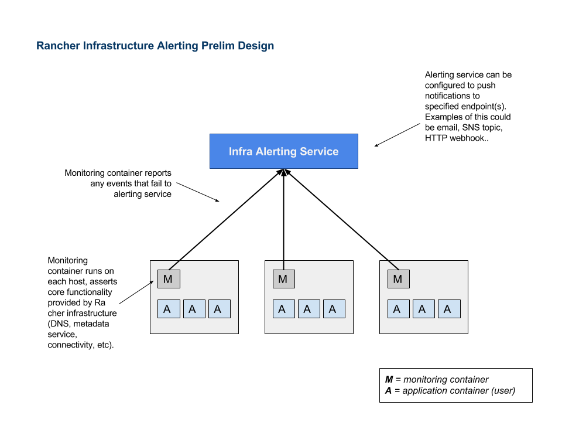

# Rancher Infrastructure Alerting 

A simple tool to monitor the core components of Rancher infrastructure.

*This is beta software and not intended for general consumption*

## Design
The tool takes the approach of asserting the functionality of a Rancher cluster
from the perspective of an application container running on a host. Each check
tries to exercise functionality that a container might use such as service discovery, 
communicating with etcd, and talking with the Kubernetes API (for example). 

When a check fails, the client makes a HTTP POST request to the server with the details of 
the failed check. The server is then responsible for surfacing the alert to the end user. 
Current implementation forwards the message to a syslog network endpoint. 

## Configuring 

configuration is done through environment variables

### Client

- `POLL_INTERVAL` - Time in seconds to sleep between polling cycles 
- `SERVER_HOSTNAME` - Hostname or IP address of alerting server to report to
- `SERVER_PORT` - Port alerting server is listening on
- `LOG_LEVEL` - Verbosity of logging for the process

### Server

- `SYSLOG_HOST` - Address of syslog server to send alerts to. Assumes port 514 and UDP 
.- `LOG_LEVEL` - Verbosity of logging for the process

## Deploying

Use the `rancher-compose.yml` and `docker-compose.yml` to create a stack in Rancher. See [Rancher Compose Docs](https://docs.rancher.com/rancher/v1.5/en/cattle/rancher-compose/)